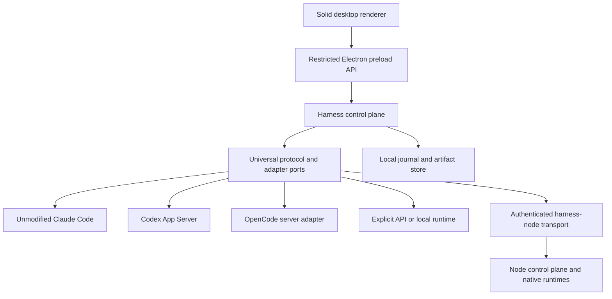

# Harness architecture

Status: architectural baseline with a privileged host, Codex adapter, Claude version/sign-in inspector and initial Electron/Solid desktop, **2026-09-07**. **Harness is a working codename.** [DESKTOP.md](DESKTOP.md), [M1A_IMPLEMENTATION.md](M1A_IMPLEMENTATION.md) and [M1B_CLAUDE.md](M1B_CLAUDE.md) distinguish implemented behavior from the broader architecture below. Claude Code 2.1.251 is status-only; its execution and native Skills activation remain blocked. The new desktop is an additive `packages/harness-desktop` application; upstream desktop/app source stays intact.

## Foundation and decision

Fork OpenCode at stable [v1.18.29](https://github.com/anomalyco/opencode/releases/tag/v1.18.29), commit `16747470f976aca3d362ad730bcd3fe82ecc2c9a`. GitHub's release `target_commitish` is not the tag's resolved commit; record the latter in `harness.product.json`. The local checkout initially contains shallow history; deepen it before an upstream merge. Retain the MIT license and copyright notices.

The application owns cross-runtime orchestration. OpenCode, Claude Code and Codex remain independent native harnesses. A model identifies inference behavior; a runtime owns a session/tool loop; an adapter translates a runtime; an execution target identifies where it runs. Remote placement is orthogonal to native/API/local inference, not a fourth mutually exclusive engine kind.

Three approaches were considered. Reusing OpenCode agents as the universal domain is inexpensive initially but loses native Codex/Claude semantics. Reorganizing the entire monorepo into the proposed `/apps` layout creates avoidable merge conflicts. **Choose additive packages and narrow desktop entry points**, preserving upstream paths and native control surfaces. This costs a separate application journal and explicit translation, which are necessary for cross-runtime identity and audit.

## Reconnaissance findings that change the plan

The pinned desktop is **Electron**, not Tauri: `packages/desktop/package.json`, `src/main/windows.ts`, `src/preload/index.ts`. Its renderer already has context isolation, sandboxing and Node integration disabled. Preserve these controls. Its server runs in an Electron utility process (`src/main/server.ts`); the Harness desktop instead launches its Bun-specific host in a separate child through inherited private pipes, keeping Bun SQLite out of Electron and the renderer.

OpenCode already splits `schema`, `core`, `protocol`, `server`, `client`, `sdk-next`, `llm`, and `session-ui`. Follow the upstream dependency rules in `AGENTS.md`. Our `packages/harness-protocol` deliberately does not reuse the existing `packages/protocol` name or import its runtime-specific schema.

`packages/app/src/context/server-sdk.tsx` already translates current and legacy OpenCode events; `utils/server-compat.ts` mediates compatibility. App and session UI reference a vendored `1.17.13-v2` client alongside the legacy SDK. These are OpenCode UI seams, not the universal protocol. Reuse the presentation primitives without making Claude/Codex emit counterfeit OpenCode sessions.

Some current `SessionV2` operations explicitly return unavailable errors; see `packages/core/src/session.ts`. Legacy MCP lives in `packages/opencode/src/mcp/index.ts`. Use the pinned legacy SDK for the initial OpenCode adapter unless the selected current API is proven to cover a specific feature. Do not stitch two native session engines together under one identity. Full classification and source anchors are in [UPSTREAM_STRATEGY.md](UPSTREAM_STRATEGY.md).

## Ownership and trust boundaries

| Layer                 | Owns                                                                                                                                            | Must not own                                                                      |
| --------------------- | ----------------------------------------------------------------------------------------------------------------------------------------------- | --------------------------------------------------------------------------------- |
| Renderer              | Conversation projections, composer, inspector, capability-driven controls, safe account labels                                                  | Credentials, processes, direct provider/server calls, permission enforcement      |
| Electron main/preload | Narrow authenticated IPC, window lifecycle, trusted pickers, control-plane process lifecycle                                                    | Model orchestration in components; generic arbitrary IPC forwarding               |
| Control plane         | Admission, auth/billing preflight, session registry, write leases, permissions, process supervision, journal, workspace services, collaboration | Reimplementation of each native agent loop                                        |
| Adapter               | Native version negotiation, events, native permissions, session identity, capability evidence, sanitized status                                 | Choosing another billing route silently; application UI state                     |
| Native harness        | Its own tools, hooks, MCP clients, skills, context management, native subagents and history                                                     | Authority to escape the application's mandatory policy                            |
| Node                  | Same admission and execution policy on its machine; locally held credentials                                                                    | Trusting a desktop-supplied path, identity or permission claim without validation |

Use a provider-specific environment allowlist and sanctioned effective-config metadata. Upstream's `createSidecarEnv()` copies parent variables; it cannot be reused unchanged for subscription sessions. Resolve executable/profile identity before launch; an executable present on PATH is not authenticated or ready. API fallback defaults off and requires scoped consent. Auth, billing route and provider extra usage are separate observations. Unknown facts remain unknown. See [ADAPTERS.md](ADAPTERS.md).

The Claude status inspector illustrates this separation: native `auth status` can establish a validated sign-in indicator, while authentication mode, subscription billing and managed policy remain unknown. Its fixed diagnostics run in the host's private directory, outside the selected repository. No prompt, startup extension or native Skills invocation is used to investigate missing admission evidence. A supported native pre-dispatch effective billing/policy interface is required before adding Claude execution.

## Session and command flow

1. Trusted picker opens a repository; the control plane canonicalizes the path, resolves target/workspace and obtains the necessary lease.
2. User chooses runtime, model and explicit auth/billing intent. Preflight reports supported features, effective account evidence, environment conflicts and enforcement limits without credentials.
3. Admission binds that exact selection, target, workspace, policy and expiring preflight result. Account/config changes invalidate admission. Only an admitted command may start native work.
4. Adapter returns a command receipt; acceptance is distinct from completion. A continuous event stream spans turns and idle native updates. Native session/turn IDs remain separate from application IDs.
5. Control plane assigns durable sequence numbers and persists sanitized events before publication. Text deltas and completion snapshots update the same part. Permission replies bind to the original request, target, session and lease.
6. Resume reconciles native state and the application journal. Future cross-runtime handoff creates a new native session; it cannot resume another vendor's native history. The current desktop rejects runtime switching while a session is attached. Before attachment, switching clears the executable/account-home selection, connection evidence and admission acknowledgments; selecting Claude does not create a session.

Detailed contracts, replay rules and failure semantics are in [PROTOCOL.md](PROTOCOL.md).

## Persistence and reuse

Use a separate Harness SQLite database for projects, workspaces, sessions/native bindings, commands, normalized events, tool projections, review runs/findings/decisions, usage observations, nodes and configuration. The event journal is authoritative; projections are rebuildable and record their version. Store large diffs, logs, attachments and optional restricted raw events in a filesystem artifact store with hashes, ACLs and retention. Do not duplicate every native transcript or store binaries in SQLite.

OpenCode keeps its own isolated database and native history; Claude and Codex own theirs. Reuse SQLite/Drizzle and filesystem/Git/PTY implementations through server/host ports where compatible. Do not import upstream Core into the renderer or protocol to get a convenient helper. Upstream global paths initialize on import and a pinned migration clears V2 state; namespace all OpenCode data/config/cache/state before loading it. Native Claude/Codex logins stay in their own provider-managed stores.

## Product surface

The later desktop route retains Solid, i18n, window management, markdown, virtualized timelines, file/diff rendering and terminal presentation. Introduce a calm neutral palette, deliberate typography and sparse controls with our own assets. Sidebar: sessions, projects, search, nodes, settings. Center: conversation, observable tool activity, progress, approvals and composer. Collapsible inspector: Files, Diff, Git, Terminal, Tasks, Context, Usage, Agents. Chat/Code/Plan/Collaborate are application intent; each maps only to supported native modes. A runtime/model selector also shows execution target and verified billing route.

Accounts/Runtimes settings will distinguish installed, authenticated, preflight-blocked and ready states. Never render a connected subscription account or quota from fixture data. The current product manifest records intended identity and defaults; it is **not wired into upstream desktop packaging**. Before shipping a build, replace application IDs, deep-link schemes, data paths, updater/signing destinations and telemetry configuration together.

## Deliberate limits

The implementation includes local Codex discovery, billing admission, workspace leases, command/event persistence, private stdio, session orchestration and desktop patch/fixed-choice review. Claude has a pinned version/sign-in inspector and read-only Skills cataloging, with execution and activation unsupported. OS isolation attestation for native work, complete recovery/transcript presentation, additional runtime execution, collaboration scheduling and a listening node remain open. [M1A_IMPLEMENTATION.md](M1A_IMPLEMENTATION.md) and [M1B_CLAUDE.md](M1B_CLAUDE.md) record the exact limits; [MILESTONES.md](MILESTONES.md) retains the full acceptance gates.
