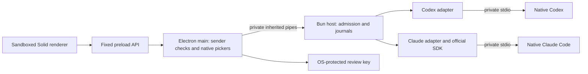

# Harness desktop

The additive `packages/harness-desktop` application connects a Solid conversation screen to the Harness control plane and independent native Codex and Claude adapters. It provides repository/runtime/account-home pickers, subscription-route admission, explicit native model choice, streaming text, tool activity, interrupt, protected file approvals, saved conversations, file/diff previews and observed usage. Claude supports explicitly selected standalone native Skills. See [V1 acceptance](V1_STATUS.md) for verified scope and outstanding live acceptance.

One conversation can be attached at a time. Close it to open another or change configuration. OpenCode's original desktop, functional source, credentials and data remain separate. The Windows portable build includes Electron and Bun; native agents remain separate user installations. [Packaging and portable launch](packages/harness-desktop/PACKAGING.md).

## Run on Windows

Development prerequisites are Bun **1.3.14**, Node **24.14.1** and this checkout. The package uses Electron **42.3.3**, Solid **1.9.10** and the existing Vite catalog. From the repository root in PowerShell:

```powershell
bun install --frozen-lockfile --ignore-scripts --filter '@harness/*'
node packages/harness-desktop/node_modules/electron/install.js
$env:HARNESS_BUN_EXECUTABLE = (Get-Command bun).Source
Set-Location packages/harness-desktop
bun run dev
```

The explicit Electron install downloads its pinned platform binary. Filtered installation disables dependency lifecycle scripts. Development startup builds local assets and opens the application; it sends no provider task. Optional development launch arguments are:

```powershell
bun run build
node node_modules/electron/cli.js . `
  --harness-bun 'C:\absolute\path\to\bun.exe' `
  --harness-data 'C:\absolute\private\Harness-development'
```

Development data defaults to `Harness-development` under Electron's OS application-data directory; packaged data defaults to `Harness`. `--harness-data` must name a private absolute directory outside repositories. Development requires an explicit Bun executable through the argument or environment variable. The packaged app resolves its bundled `resources/runtime/bun.exe`. Optional `--harness-tool-path` supplies a deliberately selected executable search path; otherwise child tools see Bun's directory and OS system directories. Provider credentials, profile overrides and runtime injection variables are not inherited.

1. Open a repository with the native picker.
2. Choose **Codex** or **Claude Code**, and select the installed executable: Codex **0.153.4** or Claude Code **2.1.251**. Other versions fail compatibility checks.
3. Select the native account's home, such as `C:\Users\you`, containing `.codex` or `.claude`. Select the home rather than the hidden runtime directory. Complete native sign-in separately. Custom `CODEX_HOME` and credential import are unsupported.
4. Check the connection and explicitly select an available model. Readiness requires native subscription and policy evidence; sign-in alone is insufficient. No model is selected automatically and no manual-ID/API fallback exists.
5. For Claude, optionally select compatible Skills and their permitted invocation modes before starting. Review the overage and unverified OS-boundary acknowledgments, choose whether reviewed file writes are permitted, and start the conversation. Sending a message is a separate explicit action.

Connection checks create no provider turn. They can initialize native processes, fetch model metadata and update native caches. Subscription authentication does not establish disabled provider overage or remaining quota. Harness checks account/configuration and policy again at admission and before each message. Model membership is checked again before Start; disappearing choices require a new selection. Listing and dispatch are not atomic and do not certify current remote entitlement.

Codex now uses a native read-only sandbox with per-patch approval. Its shell execution tools are disabled, so provide the relevant file contents in your prompt; native repository browsing and test commands are unavailable. The Files tab remains available for host previews. Saved native shell approvals cannot enable disabled tools. This restriction fixes RC1's observed automatic workspace patch approval and avoids the native workspace-write launch's project-trust side effect. [Codex isolation evidence](packages/harness-adapters/src/codex/isolation-evidence.md), [live acceptance](docs/validation/v1-live-results.json).

Claude uses the official Agent SDK **0.3.251** with the unmodified selected CLI. Its supported path is an unmanaged personal Pro/Max subscription, direct Anthropic routing, isolated settings, restricted native controls and verified initialization. Read/Edit/Write and selected Skills are supported; shell, network tools, MCP, arbitrary hooks and subagents are disabled. Managed or unverified paths block admission. [Claude execution scope](V1_CLAUDE.md).

## Saved conversations and recovery

The sidebar lists a bounded local history. Viewing a conversation reads the journal and never attaches, resumes or replays a message. It labels partial/truncated previews and attempted input whose delivery is unconfirmed. Configuration is selected again after restart; resume requires the original canonical repository, runtime, executable and native account-home binding, compatible current account/configuration evidence, model availability and fresh acknowledgments.

Cleanly settled conversations can resume explicitly using their exact native session ID. Codex also exposes native inspection and reconciliation for known uncertain turns. Inspection and reconciliation never resend input. Claude uncertain recovery remains unavailable because the pinned public SDK does not provide the required non-mutating native outcome proof. Unknown creates without a saved native session cannot be safely assigned to a workspace and block new work globally in that journal. There is no reset button that assumes such work never happened.

Closing stops the attached native runtime and releases only proved ownership. A failed close still attempts adapter shutdown and preserves uncertainty. File baselines and pending review authority are invalidated on detach; checking the connection again is required before new work.

## Files, usage and Skills

The Files tab lists bounded workspace text files using opaque IDs, with explicit refresh and inert previews. Diffs compare against the in-memory snapshot taken at session start. They are inspection previews, not applicable patches or Git HEAD diffs. After restart/resume/history view the baseline is unavailable. Dependency, build and runtime directories, `.env` files, binary/oversized files and observed unsafe links are excluded. Limits and unreadable entries mark scans partial; partial scans cannot prove deletions.

The Usage tab renders native telemetry only. Codex cumulative session counts replace the previous snapshot; Claude reports per-turn main-loop counts with declared cache relationships. Context capacity is shown when reported, but current occupancy, subscription charges, remaining quota and unreported compactions remain unknown. Cumulative tokens are not context utilization. SDK cumulative cost estimates are omitted because they do not share the scope of per-turn token counts.

The Skills tab discovers immediate `.claude/skills/<skill>/SKILL.md` entries and an optionally selected personal skills root. Selecting a Skill binds its observed hash, source, workspace, runtime, target, policy and invocation mode. Compatible standalone files are staged unchanged into isolated native Claude plugins; the native runtime loads and executes them. The host revalidates sources and staged content, and native tool declarations cannot grant additional authority. Dynamic shell content, supporting resources, model overrides, forked contexts, hooks and arbitrary plugins remain outside V1. [Claude Skills details](CLAUDE_SKILLS.md).

## Process and storage boundaries



The renderer loads only built assets at `harness://desktop/index.html`. Context isolation and sandboxing are enabled, Node integration is disabled, and permission requests, new windows, navigation and webviews are denied. CSP blocks network and external executable content. Preload exposes named operations without arbitrary channels, paths, commands, keys or actor identities. Main validates sender object, main frame and exact URL before privileged work and after asynchronous returns.

Main owns native pickers and a random review key protected with Electron safeStorage (Windows DPAPI). Unavailable secure storage or corrupt/unsafe envelopes stop startup; no plaintext fallback exists. The OS-wrapped key is persisted in `artifact-key.json`; plaintext bytes pass only to the private host during initialization and temporary buffers are cleared. This does not protect against a hostile process with the same OS privileges.

The Bun child owns SQLite journals, encrypted review artifacts and native adapters. No HTTP listener is opened. Strict schemas, UTF-8 framing, size limits and correlation reject malformed traffic. Host failure clears review controls, records uncertainty and never replays prompts. Permission/question content stays encrypted until explicitly reviewed, then appears as inert text. Review tokens remain in memory, expire within 60 seconds and are checked again at the native reply boundary. Workspace identities, observed links and private-storage overlaps are checked; local leases do not constitute OS sandbox attestation or cross-process fencing.

## Validation and limits

From `packages/harness-desktop`:

```sh
bun run typecheck
bun test test/unit
bun run build
bun run test:ui
```

For `bun run test:electron`, set `HARNESS_SMOKE_BUN` and `HARNESS_SMOKE_ROOT` to absolute local paths. The test creates isolated data, starts the built app twice and checks the sandbox, preload API and OS key envelope. Missing inputs explicitly skip the smoke. Packaged verification is described in [PACKAGING.md](packages/harness-desktop/PACKAGING.md). Production has no sample conversation or fixture bridge fallback; standalone `preview:web` reports a missing desktop bridge.

Native command/network/policy-expansion approvals remain deny-only. Codex supports the bounded once-only workspace patch review path and fixed-choice blocking questions; secret/free-form/nonblocking questions remain unsupported. Rich terminal/Git operations, OpenCode execution, collaboration, remote nodes, cross-process fencing, installers, signing, updates and macOS/Linux smoke checks remain later milestones. Local fixtures and native no-prompt diagnostics do not replace live repository acceptance. See [recorded checks](VALIDATION.md).
