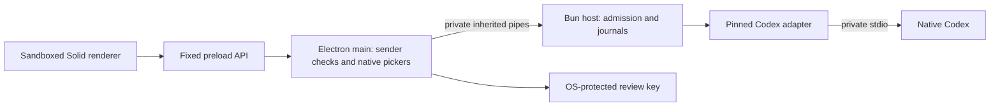

# Harness development desktop

The additive `packages/harness-desktop` application connects a Solid conversation screen to the existing Codex host. It has native repository/runtime/account-home pickers, subscription-route status, an explicit model field, streaming text and activity, interrupt, protected patch approval and blocking fixed-choice questions. The Claude Skills panel catalogs the selected repository and an explicitly selected personal skills folder. Skill execution remains disabled until the Claude native adapter is implemented and validated.

This is a development application, with one attached session per launch. It is not a signed installer or full M1 delivery. OpenCode's original desktop, application source, credentials and data remain separate.

## Run on Windows

Prerequisites: Bun **1.3.14**, Node **24.14.1**, and this checkout. The package reuses Electron **42.3.3**, Solid **1.9.10** and the existing Vite catalog. From the repository root in PowerShell:

```powershell
bun install --frozen-lockfile --ignore-scripts --filter '@harness/*'
node packages/harness-desktop/node_modules/electron/install.js
$env:HARNESS_BUN_EXECUTABLE = (Get-Command bun).Source
bun --cwd packages/harness-desktop dev
```

The explicit Electron installer step downloads its pinned platform binary; filtered installation disables all package lifecycle scripts. The desktop `dev` command builds the application and starts the resulting local build. It does not connect to a web development server or send a provider task.

For an already-built application, use the local Electron CLI with these optional arguments:

```powershell
bun --cwd packages/harness-desktop run build
node packages/harness-desktop/node_modules/electron/cli.js packages/harness-desktop `
  --harness-bun 'C:\absolute\path\to\bun.exe' `
  --harness-data 'C:\absolute\private\Harness-development'
```

Data defaults to `Harness-development` under Electron's OS application-data directory. `--harness-data` must name a private absolute directory outside repositories. `--harness-bun` or `HARNESS_BUN_EXECUTABLE` must identify an explicit Bun executable. Optional `--harness-tool-path` supplies a deliberately selected executable search path; otherwise child tools see Bun's directory and OS system directories only. Provider credentials, profile overrides and runtime injection variables are not inherited.

1. Open a repository through the native picker.
2. Select an installed **Codex 0.153.4** executable. Other versions fail compatibility checks.
3. Select the native account's user home, which contains `.codex`, such as `C:\Users\you`. This sets the child's `HOME`/`USERPROFILE`; custom `CODEX_HOME` overrides are not supported. Complete native sign-in separately in Codex.
4. Check the connection. This reads native account/configuration evidence without creating a thread or turn. Enter an exact model ID available in native Codex; model discovery is not implemented yet.
5. Review the explicit provider-overage and unverified-OS-boundary acknowledgements, and choose whether reviewed file changes are permitted. Start the conversation, then explicitly send a message.

Selecting a repository or scanning skills does not launch Codex. The desktop does not import subscription tokens, provide API-key login or automatically change billing routes. Provider overage remains unknown even when subscription authentication is observed. Native account/configuration and policy are checked again at session admission and before each message.

## Process and storage boundaries



The renderer loads only built assets at `harness://desktop/index.html`. Context isolation and sandboxing are enabled, Node integration is disabled, and permission requests, new windows, navigation and webviews are denied. CSP blocks network access and executable content from other origins. The preload exposes named operations without arbitrary IPC channels, paths, native commands, keys or actor identities. Main validates sender object, main frame and exact URL before privileged work and after asynchronous returns.

Main owns native folder/file selections and a random review key protected with Electron safeStorage. Windows uses DPAPI; unavailable secure storage and corrupt/unsafe key envelopes stop startup. There is no plaintext fallback. The OS-wrapped key is persisted in `artifact-key.json`; plaintext key bytes only pass to the private host during initialization and are cleared from temporary buffers. This does not provide protection against a hostile process with the same OS privileges.

The Bun child owns the SQLite journal, encrypted artifact store and native adapters. No HTTP listener is opened. Strict request schemas, UTF-8 framing, size limits and correlation reject malformed input and responses. Host failure clears review controls and reports uncertain state; it never replays a prompt. Pending permission/question content stays in encrypted artifacts until explicitly reviewed, then appears as inert text. Review tokens remain in memory, expire within 60 seconds and are checked again at native reply time.

Workspace identity is derived from its canonical path, with Windows case normalization. Interrupted or ambiguous previous work prevents a fresh session in that workspace. An uncertain create with no saved session cannot safely be assigned to a workspace, so it blocks new sessions globally in that application journal. Recovery requires native inspection; the desktop does not expose a reset or assume the work never happened. Journal/database sidecars and catalog paths are checked for observed links and unsafe file identities. These checks and process-local leases do not constitute an attested OS execution sandbox or cross-process fencing.

## Claude Skills

Open the Skills panel to inspect `.claude/skills/<skill>/SKILL.md` metadata from the selected repository. A separate native picker can authorize a personal skills directory. Entries show scope, command/name, description and detected native features, with activation explicitly unavailable. Bodies, referenced files, hooks and scripts are not executed or injected into Codex. Discovery is bounded and rejects known unsafe paths. See [Claude Skills integration](CLAUDE_SKILLS.md) for compatibility limits and the future activation contract.

## Current limits and validation

The desktop supports one attached session. Configuration is selected again after restart; full transcript restoration, native history/recovery presentation, multiple conversations, model discovery, rich tool/terminal/file browsing and usage presentation remain open. The screen uses a bounded preview; truncation is reported. It does not claim to display every retained native event. Native command/network/policy-expansion approvals remain deny-only; file approval is limited to the implemented once-only workspace patch path. Secret/free-form/nonblocking questions remain unsupported.

Native Claude and OpenCode execution, skill activation, collaboration, remote nodes, installer identity/signing/updaters and macOS/Linux application smoke checks are future work. No live provider task or billing charge was used to validate this continuation. Local process fixtures verify native protocol behavior; the Electron smoke verifies desktop startup and the OS key envelope. See [the recorded checks](VALIDATION.md).

Validation commands from `packages/harness-desktop`:

```sh
bun run typecheck
bun test test/unit
bun run build
bun run test:ui
```

For `bun run test:electron`, first set `HARNESS_SMOKE_BUN` to an absolute Bun executable and `HARNESS_SMOKE_ROOT` to an absolute scratch directory. The test creates its own child directory, starts the built app twice, checks its sandbox/bridge/key envelope, and removes its test data. Without these inputs the smoke test skips explicitly. Browser and Electron tests use the Playwright configurations under `test/ui` and `test/electron`; see their exact recorded commands in the validation results. Production has no fixture bridge or sample conversation fallback. The standalone `preview:web` shows a missing-desktop-bridge message.
